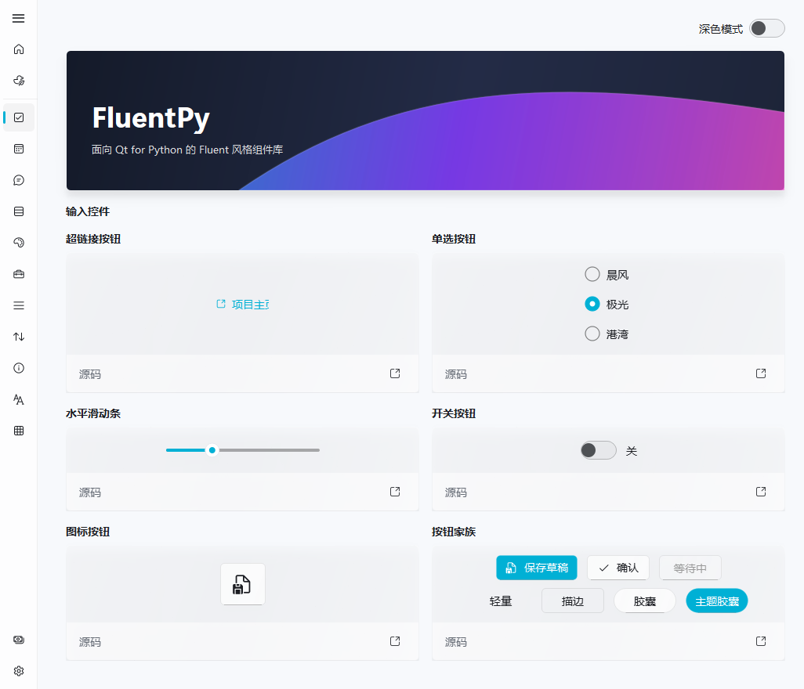
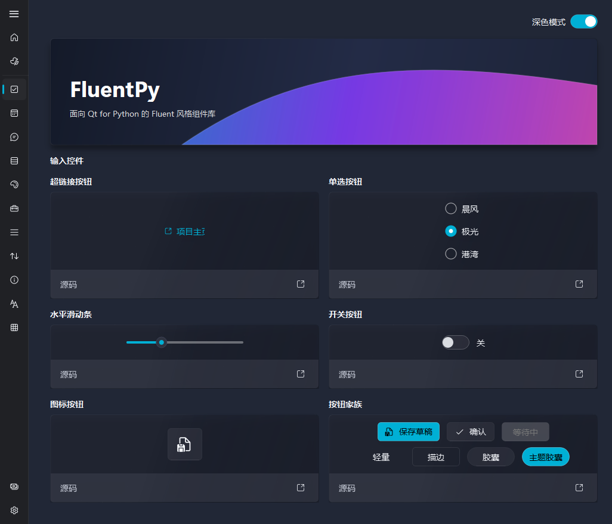

# FluentPy

面向 Qt for Python 的 Fluent 风格 UI 组件库，由 **性邓的小馒头** 独立开发，源码采用 [MIT 许可](LICENSE)。

FluentPy 基于 Qt 绘制控件，提供主题、导航、输入组件、窗口与提示等桌面应用基础能力。默认使用 PySide6，Qt 接口层保留 PyQt6 回退支持。当前为早期版本，接口仍可能调整。

[源码仓库](https://github.com/XDDXMT/FluentPy) · [问题反馈](https://github.com/XDDXMT/FluentPy/issues) · [实际应用：FluentMelody](https://github.com/XDDXMT/FluentMelody)





## 安装与运行

支持 Python 3.10 及以上。以下以 Windows PowerShell 为例，建议使用独立虚拟环境：

```powershell
git clone https://github.com/XDDXMT/FluentPy.git
cd FluentPy
python -m venv .venv
.\.venv\Scripts\python.exe -m pip install -e .
.\.venv\Scripts\python.exe examples/gallery.py
```

以上从本仓库安装，无需从 PyPI 安装同名项目。其他系统使用对应虚拟环境的 Python 运行相同脚本；Windows 材质效果在不可用的平台会回退。当前验证环境为 Windows、Python 3.13、PySide6。

## 最小示例

在安装库的环境中保存以下代码并运行：

```python
import sys

from fluentpy import AccentButton, FluentWindow, Toast
from fluentpy.qt import QtWidgets

app = QtWidgets.QApplication(sys.argv)
window = FluentWindow("FluentPy 示例")
button = AccentButton("保存")
button.clicked.connect(
    lambda: Toast.success("已保存", detail="内容已更新。", timeout_ms=2000)
)
window.content_layout.addWidget(button)
window.show()
sys.exit(app.exec())
```

## 现有组件

| 类别 | 组件与能力 |
| --- | --- |
| 按钮 | 普通、强调、描边、文字、圆形、超链接和图标按钮 |
| 输入 | 文本、密码、搜索、多行文本、复选框、单选按钮、下拉框、数值输入 |
| 导航 | NavigationView、侧栏、面包屑、Pivot、分段控件、TabBar |
| 状态 | ToggleSwitch、Slider、ProgressBar、Toast |
| 音乐视图 | NoteTimeline 音符时间轴：单轨／多轨概览、进度游标、音域和轨道配色 |
| 窗口与容器 | FluentWindow、Card、ExamplePanel、对话框与滚动条 |
| 主题与资源 | 浅色／深色主题、强调色、动画、105 个 Microsoft Fluent System Icons |

窗口支持在 Windows 上尝试启用系统 Mica 背景；卡片等组件由 Qt 绘制。具体组件与源码示例可在 [Gallery](examples/gallery.py) 中查看。

## 导航示例

在已有 `QApplication` 环境下，可以把导航容器放进窗口：

```python
from fluentpy import FluentIcon, FluentWindow, NavigationView, fluent_icon
from fluentpy.qt import QtWidgets

window = FluentWindow("导航示例")
navigation = NavigationView()
navigation.add_sub_interface(
    QtWidgets.QLabel("首页内容"), fluent_icon(FluentIcon.HOME), "首页", "home"
)
navigation.add_sub_interface(
    QtWidgets.QLabel("设置内容"), fluent_icon(FluentIcon.SETTINGS), "设置", "settings"
)
navigation.set_current_route("home", animated=False)
navigation.set_route_visible("settings", False)
window.content_layout.addWidget(navigation)
window.show()
```

`set_route_visible()` 控制入口显隐，`is_route_visible()` 查询状态。隐藏当前入口时会转到可见页面，重新显示后保留原来的页面对象与顺序。

## 音符时间轴

`NoteTimeline` 将时间、音高和时值显示为紧凑的横向音符概览，支持多轨配色与进度游标，跟随浅色／深色主题。它由 FluentMelody 的音符预览提取为独立控件，文件解析和播放由应用负责。

```python
from fluentpy import NoteEvent, NoteTimeline

# 在已有 QApplication 环境中创建控件。
timeline = NoteTimeline()
timeline.set_notes([
    NoteEvent(start=0.0, duration=0.4, pitch=60),
    NoteEvent(start=0.5, duration=0.4, pitch=64),
    NoteEvent(start=1.0, duration=0.8, pitch=67),
], duration=2.0)
timeline.set_position(0.5)
```

时间单位为秒，音高使用 MIDI 整数。运行 `python examples/note_timeline.py` 可查看单轨、多轨、空状态和静音进度演示；Gallery 的「视图」页也已接入。详见 [NoteTimeline 文档](docs/note-timeline.md) 与 [独立示例](examples/note_timeline.py)。

## 实际应用

[**FluentMelody**](https://github.com/XDDXMT/FluentMelody) 使用 FluentPy 构建口风琴演奏界面，包含 MIDI/NBS 转换、可选本地旋律模型、多人合奏与 AI 编曲。该项目的客户端和两种服务端也已开源，支持自行部署。

## 开发与测试

```powershell
.\.venv\Scripts\python.exe -m pip install -e ".[dev]"
.\.venv\Scripts\python.exe -m pytest
.\.venv\Scripts\python.exe -m build
```

`src/fluentpy` 为库源码，`examples` 为可运行的组件示例，`tests` 为测试。构建产物输出到 `dist/`，不会提交到 Git。源码、文档及文件名统一使用 UTF-8；请勿以 ANSI / GBK 重新保存。

## 许可与来源

FluentPy 是独立实现，并非其他同类型 GPLv3 UI 组件库的分支、封装或换皮。本仓库不包含本地用于视觉参考的第三方 Gallery 程序或其资源。

MIT 许可适用于 FluentPy 自身源码；Qt / PySide6 / PyQt6 等依赖有各自的许可，不能用 FluentPy 的 MIT 许可替代。图标来自 Microsoft Fluent UI System Icons，随库保留完整版权和 MIT 许可。

- [FluentPy MIT 许可](LICENSE)
- [第三方声明](THIRD_PARTY_NOTICES.md)
- [图标许可](licenses/Microsoft-Fluent-System-Icons-LICENSE.txt)
- [实现与许可边界](docs/licensing-boundaries.md)
- [WinUI 资源参考说明](docs/winui-resource-notes.md)
