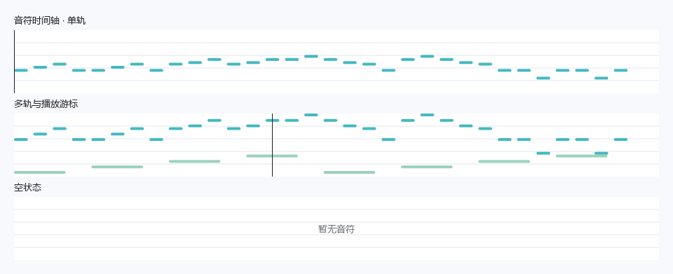
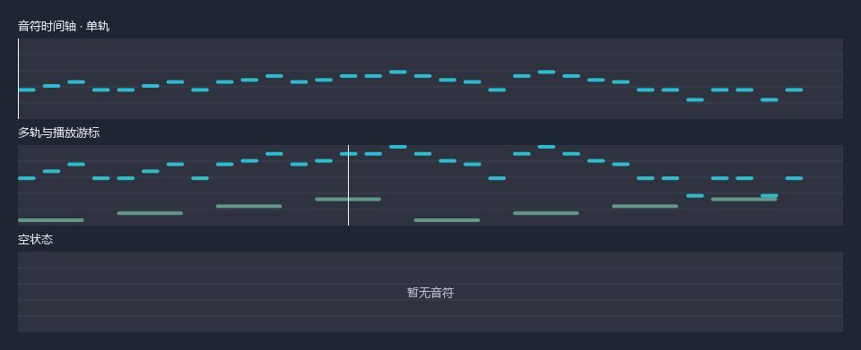

# NoteTimeline 音符时间轴

`NoteTimeline` 把一段音乐压缩成横向音符概览：横轴是时间，纵轴是音高，音符宽度表示持续时间，不同音轨可以使用不同颜色。细竖线显示当前进度。控件沿用 FluentMelody 中音符预览的轻量样式，可单独嵌入其他 Qt 界面。

它只负责显示。文件解析、播放时钟、音频输出和键盘输入由应用处理；点击或拖动时间轴不会跳转播放位置。





## 运行示例

在已安装 FluentPy 的仓库目录运行：

```powershell
python examples/note_timeline.py
```

示例可切换单轨、双轨、空状态和浅色／深色主题，用 `QTimer` 演示游标移动，不会播放声音或发送按键。完整 [Gallery](../examples/gallery.py) 的「视图」页也包含示例。

## 基本用法

```python
import sys

from fluentpy import FluentWindow, NoteEvent, NoteTimeline
from fluentpy.qt import QtWidgets

app = QtWidgets.QApplication(sys.argv)
window = FluentWindow("音符概览")
timeline = NoteTimeline()
timeline.set_notes(
    [
        NoteEvent(start=0.0, duration=0.4, pitch=60),
        NoteEvent(start=0.5, duration=0.4, pitch=64),
        NoteEvent(start=1.0, duration=0.8, pitch=67),
        NoteEvent(start=0.0, duration=1.5, pitch=48, track=1),
    ],
    duration=2.0,
)
window.content_layout.addWidget(timeline)
window.show()
sys.exit(app.exec())
```

所有时间单位均为**秒**。音高使用 MIDI 整数音高，例如 `60` 为中央 C；调用方需先把 MIDI tick 或 NBS tick 按曲速转换成秒。

## 音符数据

`NoteEvent(start, duration, pitch, track=0)` 是不可变的数据对象：

| 字段 | 要求 |
| --- | --- |
| `start` | 起始时间，有限、非负数 |
| `duration` | 持续时间，有限、非负数；允许为 `0` |
| `pitch` | `0..127` 的整数音高 |
| `track` | 从 `0` 开始的非负整数音轨编号 |

起始时间与持续时间之和也必须有限。非法数值会抛出 `ValueError`。零时值音符仍显示为一个小音符点，适合没有持续时间的数据源；这不会给音符补上实际播放时长。

## 接口

| 接口 | 行为 |
| --- | --- |
| `NoteTimeline(parent=None)` | 创建控件，默认空状态文字为「暂无音符」 |
| `set_notes(notes, *, duration=None)` | 接收 `NoteEvent` 可迭代对象并保存副本；总时长取指定时长与最晚的音符结束时间的较大值；每次载入都将游标归零 |
| `notes()` | 返回当前音符的元组 |
| `duration()` | 返回当前总时长，单位为秒 |
| `set_position(seconds)` | 设置游标，有限数值会限制到 `0..duration()` |
| `position()` | 返回当前游标位置，单位为秒 |
| `positionChanged(float)` | 仅在有效位置实际变化时发出信号，包括载入／清空导致的归零 |
| `set_pitch_range(minimum=None, maximum=None)` | 两个参数均省略或均为 `None` 时自动适配；固定范围需同时提供两个 `0..127` 的整数且下限不大于上限 |
| `pitch_range()` | 返回当前有效音域 `(minimum, maximum)`；自动模式下没有音符时为 `(48, 85)` |
| `set_track_colors(colors)` | 设置非空调色板，元素为有效颜色字符串或 `QColor` |
| `set_empty_text(text)` / `empty_text()` | 设置／读取空状态文字 |
| `clear()` | 清除音符、总时长和游标，保留音域模式、颜色与空状态文字设置 |

`set_notes()` 不要求数据按时间排序，不修改调用方的列表；修改列表后需要再次调用它。传入非 `NoteEvent` 元素会抛出 `TypeError`。指定较长的 `duration` 可保留曲尾休止，较短的值不会截掉音符；空列表也可单独设置总时长。

固定音域之外的音符不会显示，但仍保留在 `notes()` 中，也参与总时长计算。自动音域只依据音高分布，图中横线是辅助线，不是五线谱。

## 更新进度

在应用中，把播放时钟报告的秒数传给 `set_position()`：

```python
# 此方法应在 Qt GUI 线程调用。
timeline.set_position(1.25)
timeline.positionChanged.connect(lambda seconds: print(f"当前位置：{seconds:.2f} 秒"))
```

控件没有内部播放计时器。后台播放器应通过 Qt 信号把进度送到界面线程；暂停或继续也由播放器控制。示例中的计时器仅用于展示，不能代替实际音频时钟。

## 外观与多轨

```python
timeline.set_pitch_range(48, 85)  # 固定可见音域
timeline.set_track_colors(["#4b7da0", "#66a58e", "#b28bbc"])
timeline.set_empty_text("载入歌曲后显示音符")

timeline.set_pitch_range()  # 恢复自动音域
```

颜色按 `track % 颜色数量` 循环使用。未指定调色板时，第一轨跟随主题强调色，后续音轨使用默认配色；自定义颜色在主题切换后仍保留。背景、辅助线、空状态文字和游标跟随全局 `theme`。

音符层会缓存，移动游标时复用已绘制的音符；修改数据、音域、配色、主题或控件大小会刷新缓存。高分屏按设备像素比绘制，无需额外绘图库或音乐解析依赖。

## 集成范围

控件适合歌曲概览、音轨预览和播放进度展示。它没有编辑音符、缩放、拖动进度、选区或音频播放功能。可以把它放进 `Card`、布局或其他容器，像普通 `QWidget` 一样设置高度和尺寸策略。
